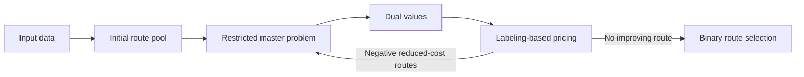
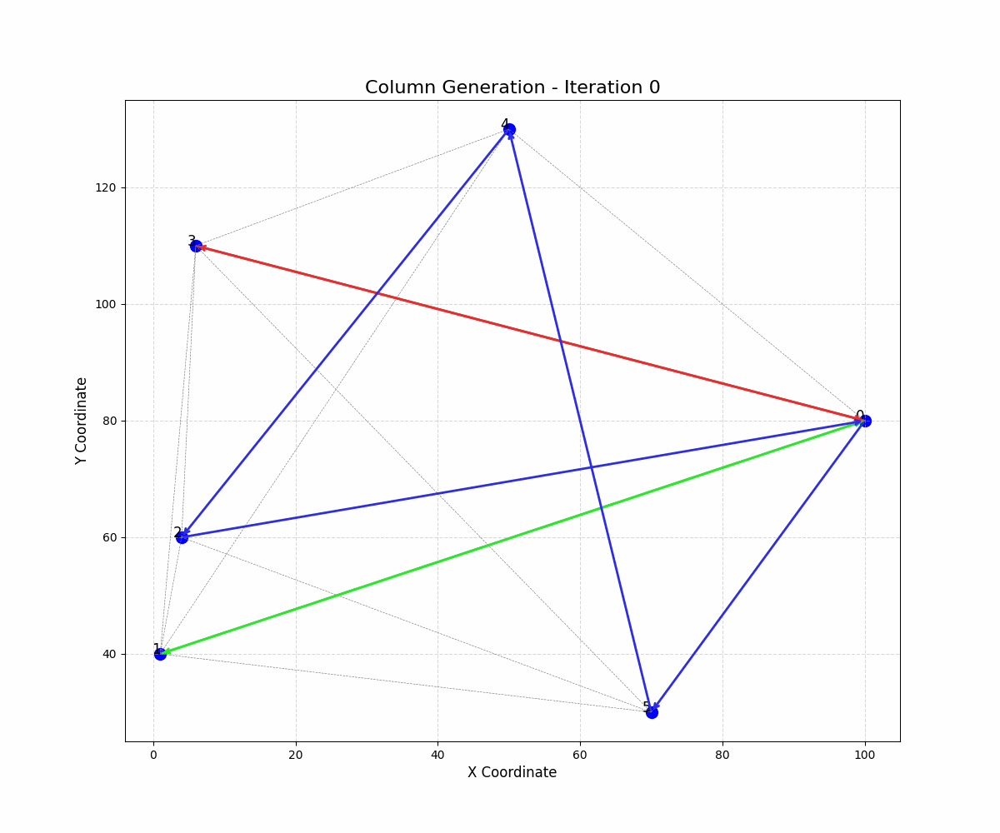

# CVRPSPD Column Generation Solver

An educational implementation for the **Vehicle Routing Problem with Simultaneous Pickup and Delivery (VRPSPD)**. The solver combines a direct Gurobi model with a column-generation workflow based on a restricted master problem and labeling-based pricing.


## Overview

The repository models routes that must satisfy customer coverage, vehicle-count, capacity, pickup, delivery, and service-time considerations. It provides both a direct optimization model and a decomposition-style route-generation workflow for studying their behavior on the included small instances.

## Problem Definition

Each route starts and ends at the depot. A feasible solution selects routes that cover every customer while respecting vehicle capacity and route-level operational constraints. Pickup and delivery quantities are tracked during label extension.

## Mathematical Components

### Direct model

`source/model/origin_model.py` builds a Gurobi formulation of the original routing model. It is used as a reference implementation for the included instances.

### Restricted Master Problem

`source/model/master_model.py` maintains a route pool with continuous route-selection variables, customer-coverage constraints, and a vehicle-count constraint. After column generation terminates, the code resolves the route-selection model with binary variables.

### Pricing Problem and Labeling

`source/model/sub_model.py` extends labels that record route state, including the visited set, elapsed time, pickup/delivery load, and accumulated cost. Dominance rules prune inferior labels, and routes with negative reduced cost are returned to the master problem.

## Algorithm Flow



## Existing Run Artifacts

The repository includes route plots, a column-generation GIF, LP exports, and log files for the `data_cap_80`, `90`, `100`, `150`, and `200` folders.

One archived `data_cap_80` run recorded an integer route-selection objective of `500.07` and an end-to-end runtime of `1.77 s`. The repository also records direct-model outcomes, but the two paths have not been validated as an apples-to-apples benchmark. For that reason, this README does not claim a solution-quality gap or performance advantage.



## Quick Start

Requires Python, Gurobi, and an active Gurobi license.

```bash
python -m pip install -r requirements.txt
cd data/data_cap_80
python ../../launch.py
```

The runner writes logs and visual outputs relative to the selected `data_cap_*` working directory.

## Repository Structure

```text
data/                 # included instances, logs, LP exports, and visuals
source/do/            # customer and vehicle objects
source/info/          # data loading and working-directory configuration
source/model/         # direct model, RMP, pricing, and CG manager
source/visual/        # route and iteration visualization
launch.py             # run entry point
```

## References

`_Standard CVRPSPD-列生成尝试.pdf` contains the repository's accompanying problem and method notes.

## License

No license has been added yet. Do not reuse or redistribute the code until a license is explicitly provided.
